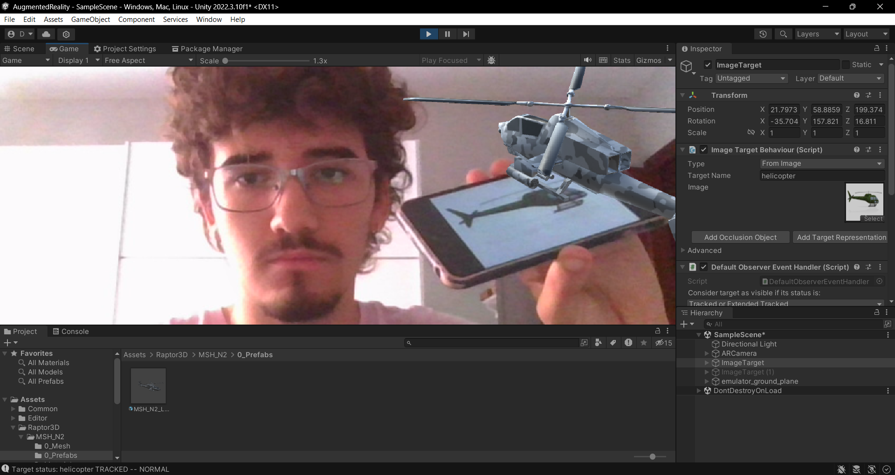

# II-P06-AugmentedReality

Para esta práctica hemos usado la Vuforia para crear una escena que use Realidad Aumentada. Se puede ver una captura de la ejecución en la siguiente imágen:



También incluí una database de imágenes que previamente subi a la página de Vuforia. Creé otro ImageTarget e hice que recogiera los datos de la base de datos, que está subida, así como las fotos usadas para el target, en la carpeta ```./database```.
